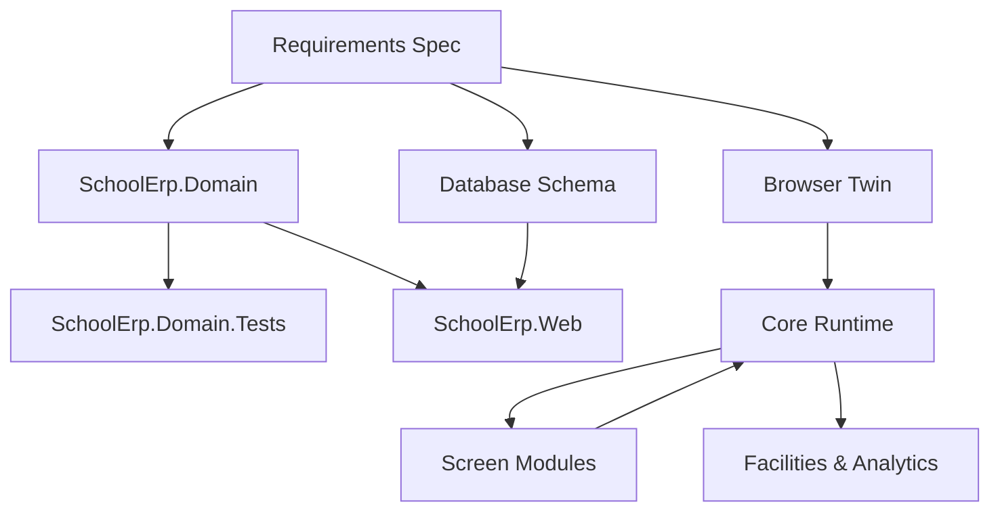

## 1. Stack
- C# — `src/SchoolErp.Domain` targets netstandard2.0 (rules only, no `System.Web`/EF/storage); `src/SchoolErp.Web` targets net48 (ASP.NET MVC 5, Razor, EF6, Hangfire, Bootstrap 5)
- JavaScript — `docs/` browser twin: plain ES modules, no build step, no dependencies (served over HTTP, not `file://`)
- SQL — `database/schema.sql`: SQL Server DDL, T-SQL stored procedures
- Tests — `src/SchoolErp.Domain.Tests` targets net9.0 + xUnit (99 tests)

## 2. Directory map
| path | what lives there |
|---|---|
| src/SchoolErp.Domain | C# domain rules (netstandard2.0): Attendance, Common, Fees, Grading, Identity |
| src/SchoolErp.Domain.Tests | xUnit tests over the domain rules |
| src/SchoolErp.Web | ASP.NET MVC 5 app: Controllers, Views, ViewModels, Services, Data, App_Start, Filters, Global.asax |
| database/schema.sql | SQL Server DDL for the production system |
| docs/ | browser twin — GitHub Pages static demo (index.html, sw.js, manifest.webmanifest) |
| docs/assets/js/core | spec.js, domain.js, data.js, store.js, auth.js, clock.js, ui.js, router.js, facilities.js, analytics.js |
| docs/assets/js/modules | one file per screen/module |
| docs/assets/css | stylesheets |
| obsidian-vault/ | pre-existing Obsidian vault documenting this repo (not this task's VAULT) |
| school_college_erp_requirements.md | the requirements spec — source of truth for both runtimes |

## 3. Diagram

## 4. Component index
- [[Requirements Spec]]
- [[SchoolErp.Domain]]
- [[SchoolErp.Domain.Tests]]
- [[Database Schema]]
- [[SchoolErp.Web]]
- [[Browser Twin]]
- [[Core Runtime]]
- [[Screen Modules]]
- [[Facilities & Analytics]]

## 5. Entry points
- Dev (browser twin): `cd docs && python3 -m http.server 8000` → http://localhost:8000 (README "Running it locally")
- Web app entry file: `src/SchoolErp.Web/Global.asax` / `Global.asax.cs`
- Browser twin entry file: `docs/index.html`
- Domain build: `dotnet build src/SchoolErp.Domain`
- Domain tests: `dotnet test src/SchoolErp.Domain.Tests` (99 passing per README)
- Web build (Windows only): `nuget restore src/SchoolErp.sln` then `msbuild src/SchoolErp.Web/SchoolErp.Web.csproj /p:Configuration=Release`

## 6. Conventions
- One spec, two runtimes: the same rules (grading, IDs, attendance, fees) are implemented once in `src/SchoolErp.Domain` (C#) and once in `docs/assets/js/core` (JS), from the same source of truth (README).
- Every screen reads "now" through one clock function instead of calling `new Date()` directly ("the Time Machine" — README).
- Dates are funneled through `parseDate` / `toIsoDate` helpers after a timezone bug (`new Date('2026-08-12')` parsing as UTC) was found in verification (README "Verification").
- Writes are stored as a delta overlay on top of generated baseline data; reads consult the overlay first (README "Writes overlay reads").
- Grading/business logic is centralized in shared calculators, not duplicated in callers — e.g. `ExamService` "contains no grading logic of its own", it calls the shared `ResultCalculator` (README).
- Module on/off switches are enforced server-side at the controller boundary via `RequireModuleAttribute`, not just by hiding nav links (README).
- Three-project split is deliberate: `SchoolErp.Domain` has no `System.Web`/EF/storage dependency so it compiles and tests on any platform; `SchoolErp.Web` carries all ASP.NET-specific code (README).

## 7. Where things go
- New business rule (grading/fees/identifiers/attendance): implement in `src/SchoolErp.Domain/<Area>/`, add an xUnit test in `src/SchoolErp.Domain.Tests/`, and mirror the rule in `docs/assets/js/core/domain.js` (or `spec.js`) for the browser twin — TODO: verify exact mirroring file per rule.
- New screen/module in the demo: add a file under `docs/assets/js/modules/`, wire it into `docs/assets/js/core/router.js`, gate visibility through `docs/assets/js/core/auth.js` module switches.
- New production controller/view: add to `src/SchoolErp.Web/Controllers` and `src/SchoolErp.Web/Views`; add supporting logic to `src/SchoolErp.Web/Services`; apply `[RequireModule]` if the feature is switch-gated.
- New DB table/procedure: edit `database/schema.sql`; keep `NVARCHAR` for Bangla text and `DECIMAL` for money, no binary columns (README "The schema").
- Module toggle change: exposed in Settings → Modules; TODO: verify exact controller/view files, not read in this pass.
